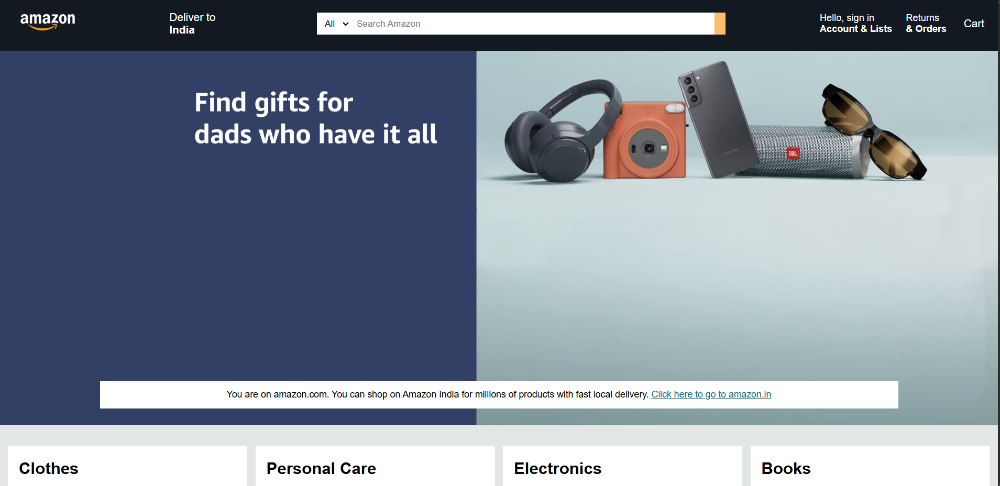
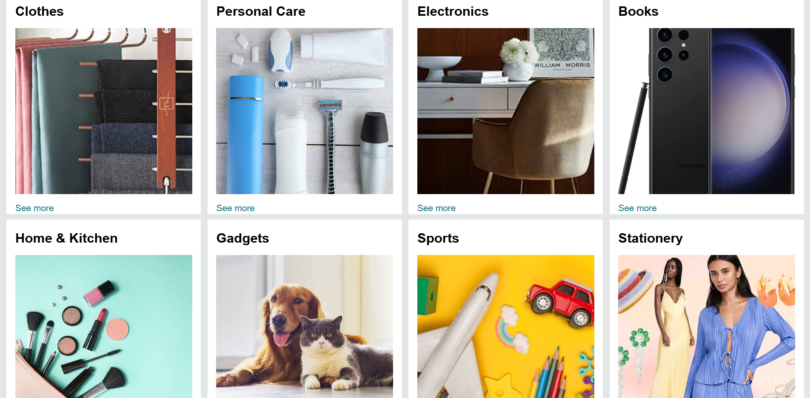
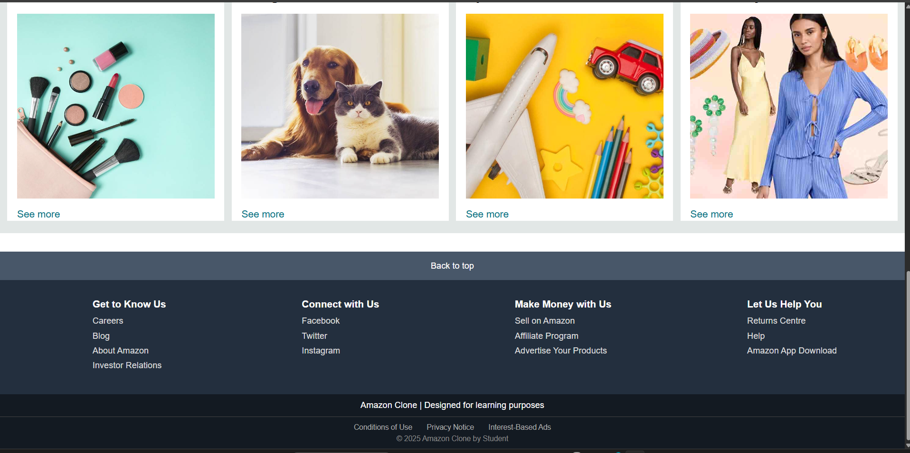

# 🛍️ Amazon Clone

A simple front-end clone of the Amazon website built using **HTML** and **CSS**.

This project replicates the look and feel of Amazon's homepage with a focus on layout, responsive design, and styling.

---

## 🌟 Features

- Header with Amazon-like navigation bar
- Product sections and promotional banners
- Responsive layout
- Clean and organized CSS

---

## 🧰 Built With

- HTML5
- CSS3
- (Optional: You can add JavaScript later)

---

## 🖥️ Live Preview
- link (file:///C:/Users/anika/OneDrive/Desktop/Project/index.html) 

---

## 📷 Screenshots

- Here’s a preview of the Amazon Clone:





---

## 📁 How to Use

1. Clone the repository:

   ```bash
   git clone https://github.com/codeWithAnika/amazon_clone.git

## 🧑‍💻 Author
- Anika Talavadekar
- [@codeWithAnika](https://github.com/codeWithAnika/)
